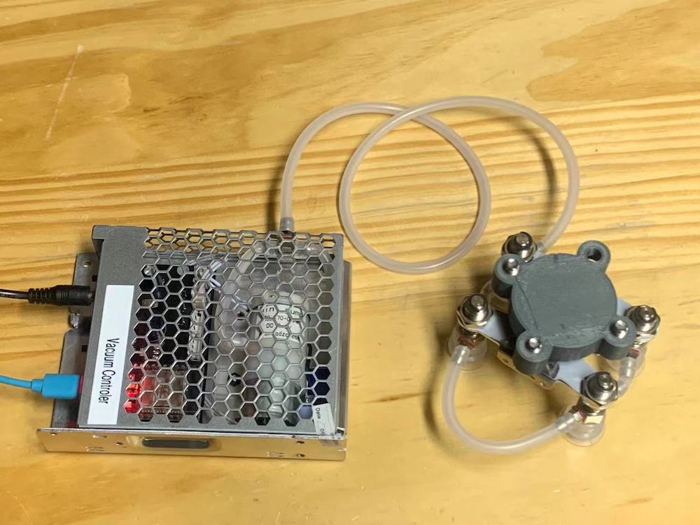
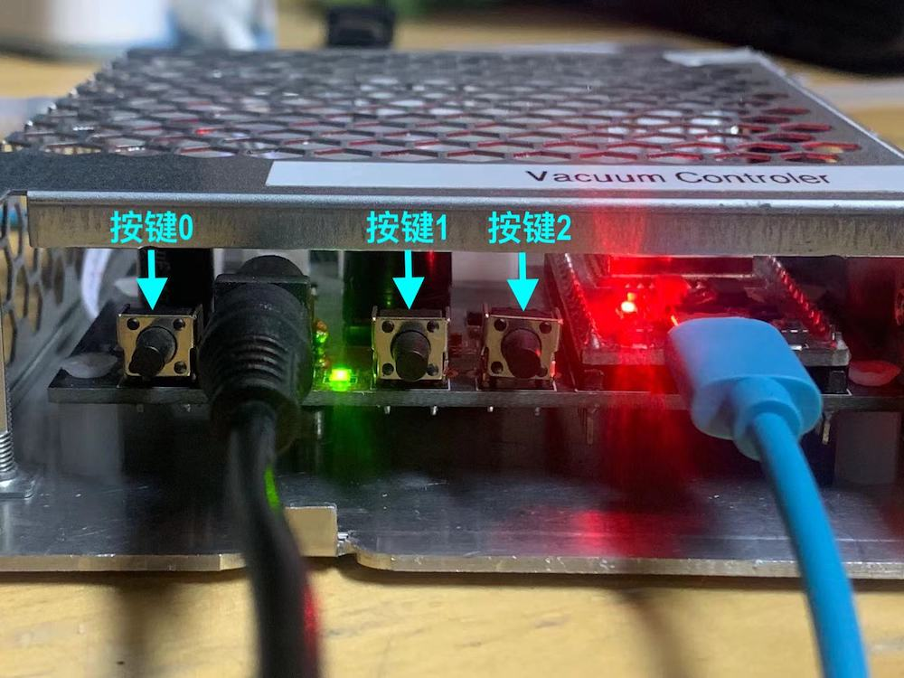

# 真空气动系统使用说明(v0.1)

**Author**：Jerry Peng   &nbsp; &nbsp; &nbsp; **Date**：Sep. 21th, 2021
  
  

## 硬件连接
* 气管部分：控制器与前端部分通过硅胶软管连接（下图为测试软件图片，发货时会附带/更换足够长的气管便于搭建应用），控制器上的软管连接接头位于其侧面上；

  `注意：当前前端4路吸盘头的共通的，需要同时按压到吸附表面才能产生真空吸力。也可根据吸附应用场景适当减少吸头数量，然后调整气管连接即可。`

 

* 电子部分：控制器上的电源和程控开发通信接口位于电路板开口一侧，其中电源接头为DC005（5.5-2.5mm），输入电源范围`5~7.5V`，电流`≥1A`；开发通信接口为Micro USB 转 UART 串口，支持在PC、开发板上使用串口进行简单的通信控制。

 

## 按键使用
如上图所示，电路板上3个按键功能如下：
* 按键0：长按2秒，MCU程序复位；
* 按键1：短按释放时，吸盘吸附；
* 按键2：短按释放时，吸盘释放。

 

## 程控开发(Python API)
参见Python_API工程文件夹，其中包含一个`Arm7Bot.py` 文件，可直接被`vacuumCtrl.py`案例调用，几点使用指南如下：
* 设备使用CP2102 USB转UART芯片，在部分操作系统上（一般是较早版本的OS以及Windows)没有默认支持，需要自行下载并安装驱动，[下载链接](https://www.silabs.com/products/development-tools/software/usb-to-uart-bridge-vcp-drivers)；
* 安装pySerial库：需要确认开发环境安装了 Python 的 pyserial lib，以便使用串口给控制器发送指令。若没有安装请先安装【[参考链接](https://pypi.org/project/pyserial/)】，否则运行案例程序时会报错；
* 确认串口名称及权限：根据开发所使用的操作系统，参考案例代码提示，确认该控制器串口在本机上的串口名称，并确认已经开启了系统下用户对串口的访问权限（尤其是Linux系统，需要开启权限或以sudo运行），否者运行案例程序是会报错；
* 使用案例代码中的`setVacuum`函数，即可实现Python对设备的控制。

