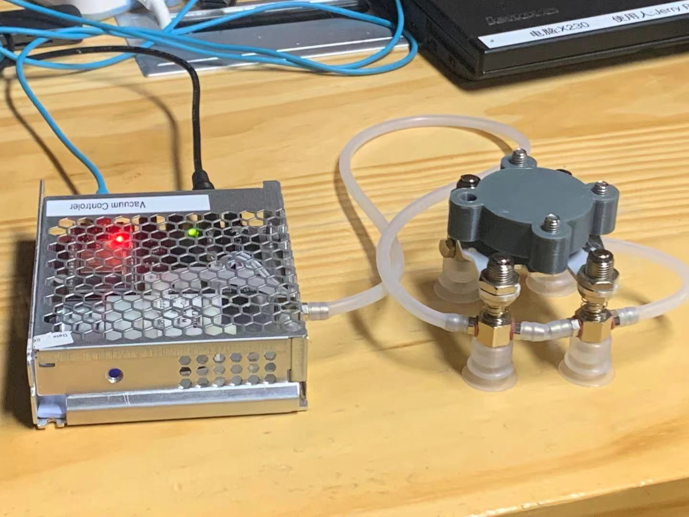
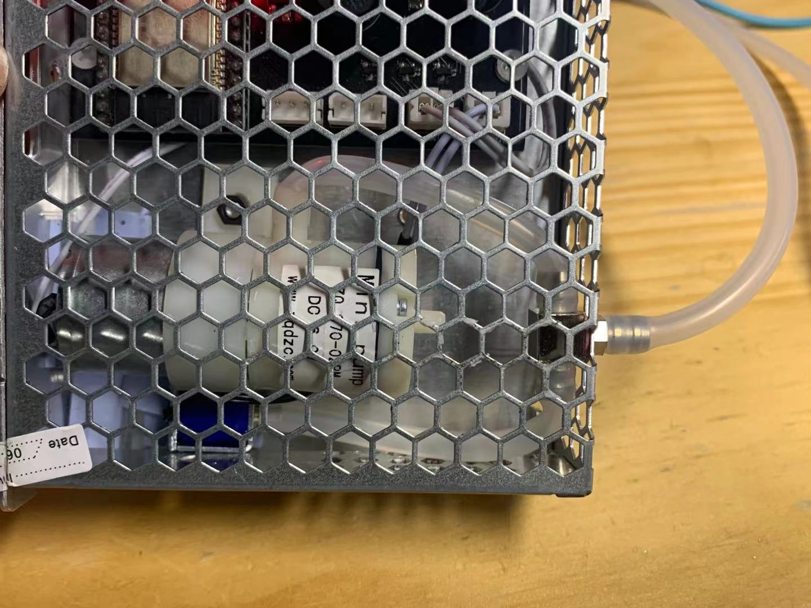

# 真空气动系统开发日志(v0.1)

**Author**：Jerry Peng   &nbsp; &nbsp; &nbsp; **Date**：Sep. 21th, 2021
  
  

 ## 硬件设计

 ### 系统概述：
 * 气动系统分为控制器和执行前端两部分，之间通过硅胶气管连接；
 * 控制器使用7Bot(V2)电路板搭建原型，对外接口为电源口（7.5V3A）、USB数据口、前端气管接口（5*3硅胶软管）。

 

  

 ### 气动部分
 * 气动部分的电动元件为：气泵、气阀（泄气阀）；其中气泵为真空发生器，气阀（常开型）用于释放时泄气；
 * 气泵、气阀、前端吸盘，三者通过三通金属接头连接；当气泵通电（抽气）、气阀通电（关闭泄气）时，管内产生真空，吸盘产生吸附效果；反之，管内恢复常压，吸盘释放。

 

 

## 固件部分
### 按键控制功能：
* btn[0]依旧同7Bot机械臂，长按MCU程序复位；
* btn[1]短按释放时，吸附；
* btn[2]短按释放时，释放。

 

### 上位机开发：
API接口同7Bot，直接使用其中的`vacuum`函数即可.